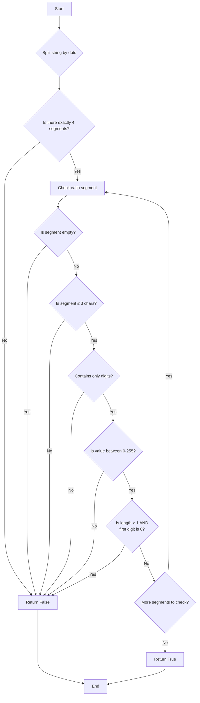

```mermaid
flowchart TD
    A[Start] --> B{Split string by dots}
    B --> C{Is there exactly 4 segments?}
    C -->|No| D[Return False]
    C -->|Yes| E[Check each segment]
    
    E --> F{Is segment empty?}
    F -->|Yes| D
    F -->|No| G{Is segment ≤ 3 chars?}
    
    G -->|No| D
    G -->|Yes| H{Contains only digits?}
    
    H -->|No| D
    H -->|Yes| I{Is value between 0-255?}
    
    I -->|No| D
    I -->|Yes| J{Is length > 1 AND\nfirst digit is 0?}
    
    J -->|Yes| D
    J -->|No| K{More segments to check?}
    
    K -->|Yes| E
    K -->|No| L[Return True]
    
    D --> M[End]
    L --> M
```